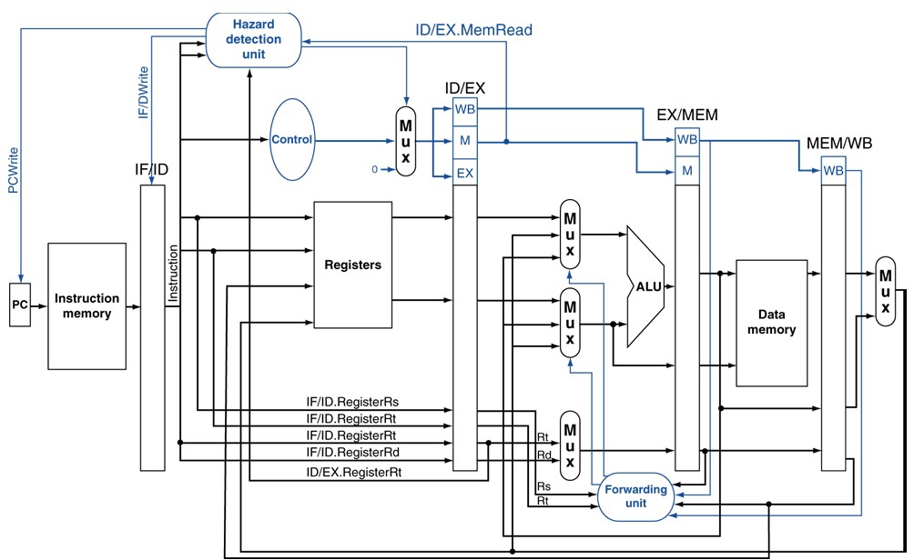
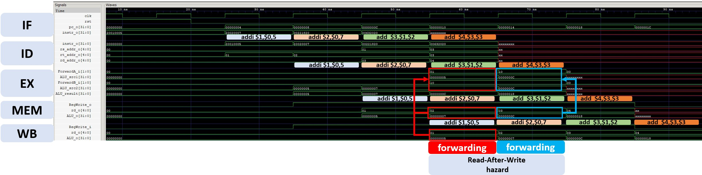
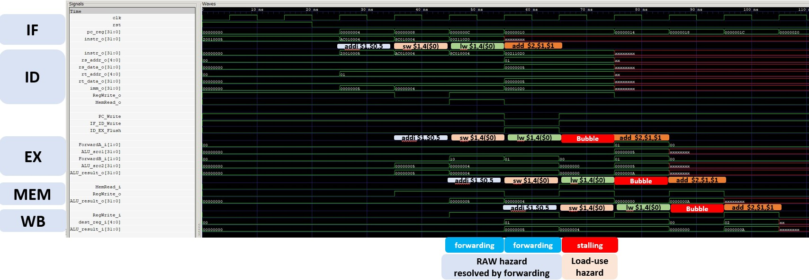
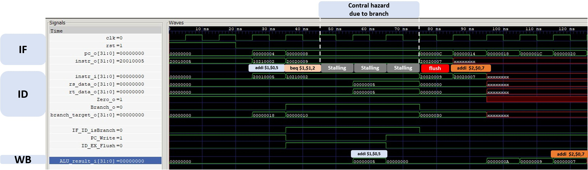

# 5-Stage Pipelined MIPS CPU with Hazard Handling

This project implements a **classic 5-stage pipelined MIPS CPU**
(IF ¡÷ ID ¡÷ EX ¡÷ MEM ¡÷ WB) with complete hazard handling support.

Supported hazard mechanisms include:
- **RAW data hazards resolved by forwarding**
- **Load-use hazards resolved by stalling and bubble insertion**
- **Control hazards resolved by stall and flush**

All behaviors are verified by waveform simulations.

---

## Pipeline Overview

- **Pipeline stages**: IF / ID / EX / MEM / WB
- **Execution model**: In-order, single-issue
- **Register write-back**: WB stage only
- **Branch decision**: ID stage
- **Hazard handling units**:
  - Forwarding Unit
  - Hazard Detection Unit

---

## Pipeline Datapath



The datapath follows a standard 5-stage MIPS pipeline architecture:

- Pipeline registers: IF/ID, ID/EX, EX/MEM, MEM/WB
- ALU used for arithmetic, logic, branch comparison, and address calculation
- Forwarding paths from EX/MEM and MEM/WB to EX stage
- Hazard detection logic controls PC write, IF/ID write, and ID/EX flush
- Branch resolution performed in the ID stage, with wrong-path instruction flush

---

## Project Structure

```text
Pipelined-CPU/
¢u¢w¢w IF/                     # Instruction Fetch
¢x   ¢u¢w¢w IF.v
¢x   ¢u¢w¢w IF_ID.v
¢x   ¢|¢w¢w instruction_memory.v
¢x
¢u¢w¢w ID/                     # Instruction Decode
¢x   ¢u¢w¢w ID.v
¢x   ¢u¢w¢w decoder.v
¢x   ¢u¢w¢w reg_file.v
¢x   ¢u¢w¢w sign_extend.v
¢x   ¢|¢w¢w ID_EX.v
¢x
¢u¢w¢w EX/                     # Execute
¢x   ¢u¢w¢w ALU.v
¢x   ¢u¢w¢w EX.v
¢x   ¢|¢w¢w EX_MEM.v
¢x
¢u¢w¢w MEM/                    # Memory Access
¢x   ¢u¢w¢w data_memory.v
¢x   ¢|¢w¢w MEM_WB.v
¢x
¢u¢w¢w WB/                     # Write Back
¢x   ¢|¢w¢w WB.v
¢x
¢u¢w¢w common/                 # Hazard handling units
¢x   ¢u¢w¢w forwarding_unit.v
¢x   ¢|¢w¢w hazard_detection_unit.v
¢x
¢u¢w¢w result/                 # Waveforms and figures
¢x   ¢u¢w¢w forwarding.jpg
¢x   ¢u¢w¢w load-use-hazard.jpg
¢x   ¢|¢w¢w branch-hazard.jpg
¢x
¢u¢w¢w datapath.jpg            # Pipelined datapath diagram
¢u¢w¢w instruction1.txt        # RAW hazard (forwarding)
¢u¢w¢w instruction2.txt        # Load-use hazard
¢u¢w¢w instruction3.txt        # Control hazard (branch)
¢u¢w¢w top_module.v
¢u¢w¢w testbench.v
¢u¢w¢w cpu.vcd
¢|¢w¢w README.md
```

This structure mirrors the actual pipeline datapath and control logic.

---

## RAW Data Hazard (Forwarding)

### Instruction Sequence
```asm
addi $1,$0,5
addi $2,$0,7
add  $3,$1,$2
add  $4,$3,$3
```

### Description

- ALU results are produced at the end of the EX stage
- Dependent instructions require operands in their EX stage
- Data is forwarded from **EX/MEM or MEM/WB to EX**
- **No pipeline stall is required**

**Waveform**  


---

## Load-Use Hazard (Stall + Bubble)

### Instruction Sequence
```asm
addi $1,$0,5
sw   $1,4($0)
lw   $1,4($0)
add  $2,$1,$1
```

### Description

- Load data becomes available only after the MEM stage
- Forwarding alone is insufficient
- Pipeline behavior:
  - PC and IF/ID stalled for one cycle
  - Bubble inserted via ID/EX flush
  - Forwarding resumes after data becomes available

**Waveform**  


---

## Control Hazard (Branch)

### Instruction Sequence
```asm
addi $1,$0,5
beq  $1,$1,+2
addi $2,$0,9   # flushed
addi $2,$0,8   # flushed
addi $2,$0,7   # branch target
```

### Description

- Branch decision resolved in the ID stage
- While unresolved:
  - PC and IF/ID are stalled
- When branch is taken:
  - Wrong-path instruction is flushed
  - PC redirected to branch target

**Waveform**  


---

## Hazard Summary

| Hazard Type | Cause | Resolution |
|------------|------|------------|
| RAW hazard | ALU dependency | Forwarding |
| Load-use hazard | Load latency | Stall + bubble |
| Control hazard | Branch decision | Stall + flush |

> All data hazards in this design are **RAW hazards**.  
> Load-use hazards are a special case where forwarding is insufficient.

---

## Summary

- Complete **5-stage pipelined MIPS CPU**
- Clean separation of datapath and hazard control logic
- Stalls applied only when strictly necessary
- Correct timing behavior verified by waveforms
